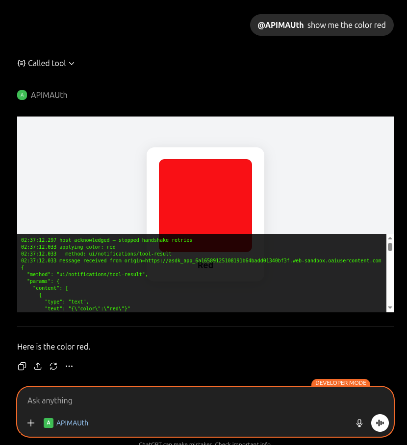

# Color Picker MCP App — APIM + CIMD OAuth

A .NET 10 MCP server that lets ChatGPT display a color card inline in the chat, secured with **Azure Entra ID OAuth 2.0** using the **CIMD** (Client ID Metadata Document) flow for zero-config connector registration.



## How it works

1. You ask ChatGPT: _"show me the color red"_
2. ChatGPT discovers the MCP server's OAuth requirements via RFC 9728 (`/.well-known/oauth-protected-resource`)
3. ChatGPT reads the server's AS metadata (`/.well-known/oauth-authorization-server`) and sees `client_id_metadata_document_supported: true` — **CIMD** is enabled
4. ChatGPT registers via CIMD: it uses its own metadata URL as `client_id` and receives pre-configured credentials from the `/register` endpoint
5. ChatGPT redirects the user to Azure Entra ID for consent; our OAuth proxy (`/oauth/authorize` → `/oauth/callback` → `/oauth/token`) translates the CIMD flow to the pre-registered Azure AD app, keeping the `client_secret` server-side
6. ChatGPT attaches the resulting JWT Bearer token to each MCP request
7. The MCP server validates the token (issuer, audience, signature) and calls the `show_color` tool
8. The tool returns `structuredContent: { "color": "red" }` and declares a UI resource
9. ChatGPT fetches the HTML card and renders it in a sandboxed iframe

```
ChatGPT
  │  1. Discovers CIMD via /.well-known/oauth-protected-resource
  │  2. Registers at /register → gets client_id + client_secret
  │  3. GET /oauth/authorize  (proxy: redirects to Azure Entra ID)
  ▼
Azure Entra ID  (issues signed JWT)
  │
  │  4. POST /oauth/callback  (proxy: form_post mode; re-signs code)
  │  5. POST /oauth/token     (proxy: validates PKCE, exchanges with Azure AD)
  ▼
ChatGPT
  │  6. POST https://<apim>.azure-api.net/mcp
  │     Authorization: Bearer <JWT>
  ▼
Azure APIM  (Consumption tier, passthrough — no auth policy)
  │
ngrok tunnel
  ▼
nginx (load balancer)
  ├─► mcp-server-1:5000  (.NET — validates JWT, handles MCP)
  └─► mcp-server-2:5000
```

## Prerequisites

- [Docker](https://docs.docker.com/get-docker/) with Compose
- A free [ngrok](https://ngrok.com) account and authtoken
- An [Azure](https://azure.microsoft.com/free) account with an active subscription
- A ChatGPT account — enable [Developer Mode](https://help.openai.com/en/articles/12584461-developer-mode-and-mcp-apps-in-chatgpt-beta) to access Connectors

## One-time setup

### 1. Configure ngrok

```bash
cp .env.example .env
# Edit .env — set NGROK_AUTHTOKEN from https://dashboard.ngrok.com/get-started/your-authtoken
```

### 2. Build the Terraform toolchain container

All Azure and Terraform operations run inside a container — nothing needs to be installed on your machine.

```bash
docker compose build terraform
```

### 3. Log in to Azure

```bash
docker compose run --rm terraform az login --use-device-code
```

Open the printed URL in a browser, enter the code, and sign in.

### 4. Start the MCP stack and note the ngrok URL

```bash
chmod +x start.sh
./start.sh
```

Note the ngrok hostname printed (e.g. `abc-123.ngrok-free.app`) — needed in the next step.

### 5. Provision Azure resources

```bash
docker compose run --rm terraform terraform init

docker compose run --rm terraform terraform apply \
  -var="ngrok_url=<your-ngrok-host>" \
  -var="publisher_email=<your-email>" \
  -auto-approve
```

Replace `<your-ngrok-host>` with just the hostname (no `https://` prefix).

> First-time APIM provisioning takes **5–15 minutes**. This also creates two Azure Entra ID app registrations and pre-grants admin consent.

### 6. Set environment variables from Terraform output

```bash
# Print all outputs
docker compose run --rm terraform terraform output

# Retrieve the client secret (sensitive)
docker compose run --rm terraform terraform output -raw chatgpt_client_secret
```

Edit `.env` and set:

```
AZURE_TENANT_ID=        # from terraform output tenant_id
MCP_API_CLIENT_ID=      # from terraform output mcp_api_client_id
MCP_PUBLIC_URL=         # from terraform output apim_gateway_url  (no trailing slash)
CHATGPT_CLIENT_ID=      # from terraform output chatgpt_client_id
CHATGPT_CLIENT_SECRET=  # from terraform output -raw chatgpt_client_secret
OAUTH_PROXY_SECRET=     # generate: openssl rand -base64 32
```

### 7. Restart the stack with the new env vars

```bash
docker compose up --build -d
```

## Day-to-day usage

```bash
./start.sh
```

If the ngrok URL has changed since the last run, update APIM:

```bash
docker compose run --rm terraform terraform apply \
  -var="ngrok_url=<new-ngrok-host>" \
  -var="publisher_email=<your-email>" \
  -auto-approve
```

**Useful commands:**

```bash
docker compose logs -f        # stream logs from all containers
docker compose down           # stop and remove containers
```

## ChatGPT Connector setup

> Developer Mode must be enabled first — see [Developer mode and MCP apps in ChatGPT](https://help.openai.com/en/articles/12584461-developer-mode-and-mcp-apps-in-chatgpt-beta).

1. Go to [chatgpt.com](https://chatgpt.com) → **Settings** → **Connectors** → **Create**
2. **Server URL**: `https://<apim-name>.azure-api.net/mcp` (from `terraform output mcp_endpoint`)
3. **Transport**: HTTP
4. **Authentication**: OAuth — select **CIMD** when prompted
5. Click **Connect** and complete the Azure sign-in
6. Start a new chat and type: _"show me the color red"_

The `show_color` tool fires, authenticates via the Entra ID JWT, and a color card appears inline.

## Teardown

### Stop the local stack

```bash
docker compose down
```

### Destroy all Azure resources (stops all billing)

```bash
docker compose run --rm terraform terraform destroy \
  -var="ngrok_url=placeholder" \
  -var="publisher_email=<your-email>" \
  -auto-approve
```

This removes the APIM instance, API, resource group, and all Entra ID app registrations. The Terraform config stays in the repo for re-provisioning.

## Trying different colors

Any CSS color name or hex value works:

- _"show me the color tomato"_
- _"display coral"_
- _"what does rebeccapurple look like"_
- _"show #ff6600"_

## Reference links

### ChatGPT / MCP
| Resource | URL |
|---|---|
| MCP Apps — blog post introducing the pattern | https://blog.modelcontextprotocol.io/posts/2026-01-26-mcp-apps/ |
| MCP specification | https://modelcontextprotocol.io/specification |
| ChatGPT Developer Mode & MCP Apps (enable Connectors) | https://help.openai.com/en/articles/12584461-developer-mode-and-mcp-apps-in-chatgpt-beta |
| OpenAI Apps SDK — Authentication (CIMD docs) | https://developers.openai.com/apps-sdk/build/auth |
| Community thread: "CIMD is unavailable" fix | https://community.openai.com/t/cimd-is-unavailable-because-the-server-did-not-advertise-cimd-support/1378920 |

### Azure
| Resource | URL |
|---|---|
| Azure free account | https://azure.microsoft.com/free |
| Azure API Management — overview | https://learn.microsoft.com/en-us/azure/api-management/api-management-key-concepts |
| Azure Entra ID — register an application | https://learn.microsoft.com/en-us/entra/identity-platform/quickstart-register-app |
| Azure AD OAuth 2.0 authorization code flow | https://learn.microsoft.com/en-us/entra/identity-platform/v2-oauth2-auth-code-flow |
| Azure AD app identifier URI policy (`InvalidUniqueTenantIdentifier`) | https://aka.ms/identifier-uri-formatting-error |

### OAuth 2.0 standards
| RFC | Description |
|---|---|
| [RFC 9728](https://datatracker.ietf.org/doc/html/rfc9728) | OAuth 2.0 Protected Resource Metadata (`/.well-known/oauth-protected-resource`) |
| [RFC 8414](https://datatracker.ietf.org/doc/html/rfc8414) | OAuth 2.0 Authorization Server Metadata (`/.well-known/oauth-authorization-server`) |
| [RFC 9700](https://datatracker.ietf.org/doc/html/rfc9700) | OAuth 2.0 Client ID Metadata Document (CIMD — `client_id` as a URL) |
| [RFC 7636](https://datatracker.ietf.org/doc/html/rfc7636) | Proof Key for Code Exchange (PKCE) |

### Toolchain
| Tool | URL |
|---|---|
| Docker | https://docs.docker.com/get-docker/ |
| ngrok — get authtoken | https://dashboard.ngrok.com/get-started/your-authtoken |
| Terraform AzureRM provider | https://registry.terraform.io/providers/hashicorp/azurerm/latest/docs |
| Terraform AzureAD provider | https://registry.terraform.io/providers/hashicorp/azuread/latest/docs |

---

## Project structure

| File/Directory | Purpose |
|---|---|
| `Program.cs` | ASP.NET Core host: MCP server, JWT Bearer auth, CIMD well-known endpoints, OAuth proxy |
| `ColorTool.cs` | `show_color` MCP tool — returns `structuredContent` and declares the UI resource |
| `ColorCardResource.cs` | MCP resource at `ui://color-card` serving the HTML widget |
| `ColorCardHtml.cs` | Inline HTML/JS card — renders the swatch and implements the MCP Apps iframe handshake |
| `Dockerfile` | Multi-stage build: .NET 10 SDK → ASP.NET 10 runtime |
| `Dockerfile.terraform` | Toolchain image: Azure CLI + Terraform (no local install required) |
| `docker-compose.yml` | MCP servers, nginx load balancer, ngrok tunnel, terraform toolchain |
| `nginx.conf` | Round-robin load balancer across two MCP server instances |
| `start.sh` | Starts containers, waits for ngrok tunnel, prints endpoints and APIM update command |
| `terraform/` | Azure infrastructure: APIM, Entra ID app registrations, admin consent grant |
