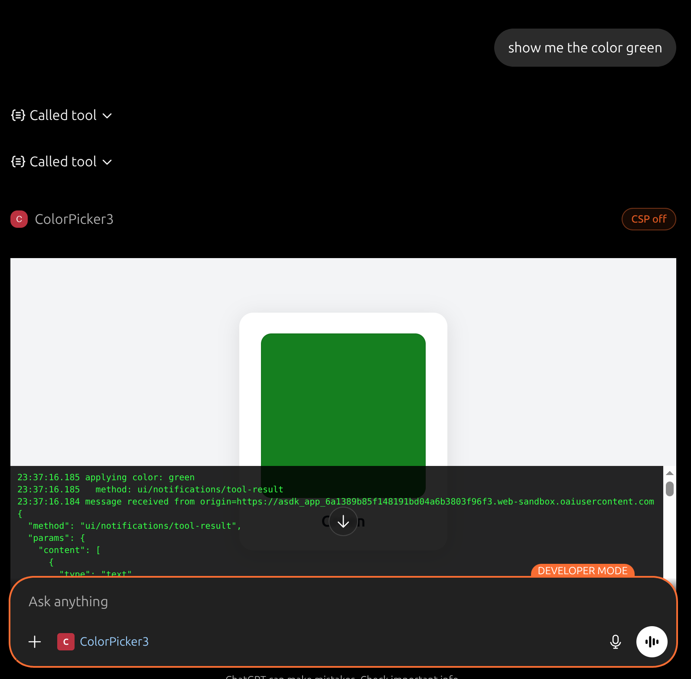

# Color Picker MCP App

A .NET 10 MCP server that lets ChatGPT display a color card inline in the chat. Built with the [MCP Apps](https://blog.modelcontextprotocol.io/posts/2026-01-26-mcp-apps/) pattern.



## How it works

1. You ask ChatGPT: _"show me the color coral"_
2. ChatGPT calls the `show_color` MCP tool
3. The tool returns `structuredContent: { "color": "coral" }` and declares a UI resource
4. ChatGPT fetches the HTML card from the MCP server and renders it in a sandboxed iframe inline in the chat
5. The card shows a colored swatch and label; the iframe completes the MCP Apps handshake (`ui/initialize` → `ui/notifications/initialized`) to receive the tool's structured output

## Prerequisites

- [Docker](https://docs.docker.com/get-docker/) with Compose
- A free [ngrok](https://ngrok.com) account and authtoken
- ChatGPT Plus/Pro account (required for Connectors)

## Setup

```bash
# 1. Copy the env template and add your ngrok authtoken
#    Get your token at: https://dashboard.ngrok.com/get-started/your-authtoken
cp .env.example .env
# Edit .env and set NGROK_AUTHTOKEN=your_token_here
```

## Run

```bash
chmod +x start.sh
./start.sh
```

The script builds the Docker image, starts the MCP server and ngrok containers, waits for the tunnel to be ready, then prints the public MCP endpoint URL.

```
============================================================
  MCP ENDPOINT: https://xxxx-xx-xx.ngrok-free.app/mcp
============================================================
```

**Useful commands:**

```bash
docker compose logs -f        # stream logs from both containers
docker compose down           # stop and remove containers
```

## ChatGPT Connector setup

1. Go to [chatgpt.com](https://chatgpt.com) → **Settings** → **Connectors** → **Create**
2. **Server URL**: the `MCP ENDPOINT` URL printed by `start.sh`
3. **Transport**: HTTP
4. **Authentication**: None
5. Click **Save**
6. Start a new chat and type: _"show me the color blue"_

The `show_color` tool fires and a color card appears inline in the chat.

## Trying different colors

Any CSS color name or hex value works:

- `"show me the color tomato"`
- `"display coral"`
- `"what does rebeccapurple look like"`
- `"show #ff6600"`

## Project structure

| File | Purpose |
|---|---|
| `Program.cs` | ASP.NET Core host with MCP server, HTTP transport, and request logging |
| `ColorTool.cs` | `show_color` MCP tool — returns `structuredContent` and declares the UI resource |
| `ColorCardResource.cs` | MCP resource at `ui://color-card` serving the HTML widget |
| `ColorCardHtml.cs` | Inline HTML/JS card — renders the swatch and implements the MCP Apps iframe handshake |
| `Dockerfile` | Multi-stage build: .NET 10 SDK → ASP.NET 10 runtime |
| `docker-compose.yml` | `mcp-server` + `ngrok` services on a shared bridge network |
| `start.sh` | Starts containers, waits for ngrok tunnel, prints the MCP endpoint |
